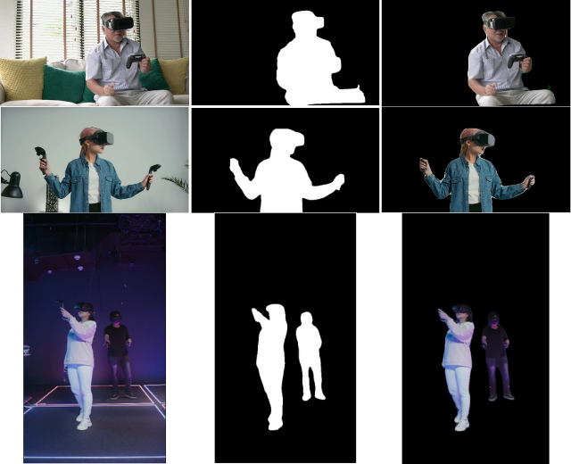

# Real-time background subtraction on human with HMD using YOLACT

## Overview

This is real-time backgrund subtraction project using YOLACT instance segmentation and custom mask generation specifically for people with HMD. 



This project uses YOLACT real-time instance segmentation library and pre-trained model. Please follow the steps in the next section to setup and run the project.

#### Development Environment

- Operating System: Linux Mint 20.3
- Kernel: 5.13.0-41-generic
- CPU: Intel i7-10700 (16) @ 4.800GHz
- GPU: NVIDIA GeForce RTX 2060 SUPER, Intel Device 9bc5
- Memory: Memory: 5341MiB / 31882MiB
- Anaconda version: conda 4.12.0
- OpenCV version: 4.5.5

## Installing and Running

#### Prerequisites

To run this project, a decent GPU is required. Anaconda should be installed on your machine as well. Read the Development Environment section as a reference. 

#### Installation

**Step 1. Clone the YOLACT project repo**

Make sure to clone YOLACT repo outside this repo.

```
git clone https://github.com/dbolya/yolact.git
cd yolact
```

**Step 2. Create a Virtual Environment**

Copy the `real-time-background-subtraction/requirements.txt` to the root of `yolact` folder. 

Run the following command to create a Anaconda environment with all the dependencies:

```
conda create --name yolact-env --file requirements.txt
```

Once the environment is successfully created, switch to that environment by running:

```
conda activate yolact-env
```

**Step 3. Gathering Scripts and Data**

For anyone who wish to train YOLACT, download MS COCO dataset by running the script inside `yolact` folder:

```
sh data/scripts/COCO.sh
```

Otherwise, we will use a pretrained model. In the root of `yolact` folder, create a new folder named `weights`. Download a pretrained model yolact_base_54_800000.pth (https://drive.google.com/file/d/1UYy3dMapbH1BnmtZU4WH1zbYgOzzHHf_/view) and copy it to the weights folder

Migrating my project code to `yolact` folder.
Copy the following files to the distination

- `real-time-background-subtraction/my_eval.py` --> `yolact`
- `real-time-background-subtraction/video_resizer.py` --> `yolact`
- `real-time-background-subtraction/coco.py` --> `yolact/data/coco.py` This will replace the original script from YOLACT which was throwing an error. 
- `videos/original_videos` --> `yolact/videos`

#### Running the project

**Step 1. Video Preprocessing**

Make sure you are in the `yolact` folader in a terminal/command prompt with `yolact-env` activated.

Run the following command:

```
python video_resizer.py
```

This will take the original resolution vr-player.mp4, resize it down and apply smoothing. The output video is stored in a newly created folder as `videos/preprocessed_videos/vr-player-resized.mp4`. You are wellcome to open the `video_resizer.py` and change the source and distination video path, as well as the target resolution. 

**Step 2. Run Background Subtraction**

Run the following command to perform the background subtraction on the resized video and displays it real-time.

```
python my_eval.py --trained_model=weights/yolact_base_54_800000.pth --score_threshold=0.15 --top_k=15 --video=your-video.mp4
```

To write the video, specify the distination file name after the source file separated by colon.
```
python my_eval.py --trained_model=weights/yolact_base_54_800000.pth --score_threshold=0.15 --top_k=15 --video=your-video.mp4:new-video.mp4 
```

And the code should run and produce the results shown in the overview image. 
Make sure you have downloaded the pretrained model mentioned in step 3.

## Reference

vr-player.mp4: https://www.videezy.com/technology/54666-asian-elderly-man-playing-video-game

vr-player2.mp4: https://www.pexels.com/video/a-woman-playing-virtual-reality-game-6615421/

vr-player3.mp4: https://www.pexels.com/video/people-playing-video-game-in-virtual-reality-mode-6499155/
